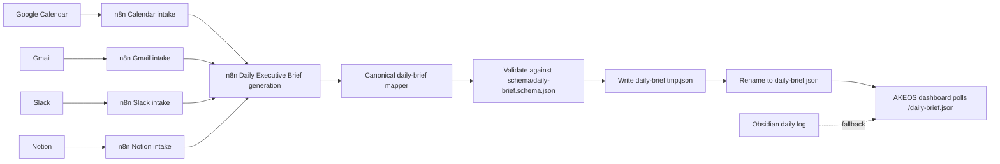

# n8n Daily Brief Contract

This dashboard treats n8n as the upstream producer for the Daily Executive Brief. The dashboard does not call Calendar, Gmail, Slack, Notion, or AI services directly. Those systems should feed n8n, and n8n should publish one canonical JSON file for the dashboard to read.

## Data Flow



## Output Target

In local development, mount the dashboard public directory into the n8n container:

```text
/Users/akeos/akeos/projects/akeos-command-center/public:/dashboard-public
```

n8n should write the generated JSON to:

```text
/dashboard-public/daily-brief.json
```

Vite serves that file as:

```text
/daily-brief.json
```

The dashboard polls `/daily-brief.json` every 60 seconds. If the file is missing, malformed, empty, or contains no usable brief content, the dashboard falls back to the existing Obsidian markdown flow.

## Atomic Write Requirement

n8n should preferably avoid writing directly over `daily-brief.json` while the dashboard may be reading it. Write a complete temporary file first, validate it, then rename it over the final path when the n8n runtime supports command execution. In the local n8n 2.19.5 container, `Execute Command` is unavailable, so AKEOS-004 writes the temp file first and then writes the final file with a second `Read/Write Files from Disk` node.

Recommended local-dev sequence:

```text
1. Build the canonical JSON payload in n8n.
2. Validate the payload against schema/daily-brief.schema.json.
3. Write the payload to:
   /dashboard-public/daily-brief.tmp.json
4. Publish daily-brief.json by atomic rename when available, or by a second file-write node in this local n8n runtime.
```

The rename step should be atomic on the same filesystem. If n8n runs somewhere other than the dashboard host, publish the same JSON payload to whichever static asset location serves `/daily-brief.json` in that environment.

## Canonical JSON Shape

```json
{
  "generatedAt": "2026-05-29T07:00:00+02:00",
  "todaySummary": "# Daily Executive Brief\n\n## Executive Summary\n- Summary bullet",
  "meetings": [
    {
      "time": "09:00",
      "title": "Board Strategy Review",
      "badge": "Critical",
      "prep": "Revenue forecast + GTM risks"
    }
  ],
  "priorityEmails": [
    {
      "from": "sender@example.com",
      "subject": "Pipeline review inputs",
      "summary": "Needs latest GTM forecast before the board review.",
      "urgency": "High",
      "actionRequired": "Send revised forecast summary before 08:30."
    }
  ],
  "followUps": [
    "Confirm owners for Stuttgart Strategy Days preparation"
  ],
  "priorities": [
    {
      "title": "Drive GTM Execution & Pipeline",
      "status": "High"
    }
  ],
  "risks": [
    "Operational overload and excessive context switching"
  ],
  "recommendedAction": "Protect the first deep-work block for GTM execution."
}
```

## Example n8n Mapping

### Calendar to `meetings`

Map each relevant Google Calendar event into a meeting object:

```js
const meetings = calendarEvents.map((event) => ({
  time: event.start?.dateTime
    ? new Date(event.start.dateTime).toLocaleTimeString("en-US", {
        hour: "2-digit",
        minute: "2-digit",
        hour12: false,
      })
    : "TBD",
  title: event.summary || "Untitled meeting",
  badge: event.attendees?.length > 5 ? "Strategic" : "Normal",
  prep: event.description || event.location || "Review context before meeting",
}));
```

Suggested mapping:

- `event.start.dateTime` or `event.start.date` -> `meetings[].time`
- `event.summary` -> `meetings[].title`
- priority classification from attendees, calendar, keywords, or AI -> `meetings[].badge`
- event description, agenda, location, or AI-generated prep note -> `meetings[].prep`

### Gmail to `priorityEmails` and `followUps`

Map high-signal Gmail messages into `priorityEmails`:

```js
const priorityEmails = gmailMessages
  .filter((message) => message.isImportant || message.requiresReply)
  .map((message) => ({
    from: message.from || "",
    subject: message.subject || "No subject",
    summary: message.snippet || message.summary || "",
    urgency: message.isImportant ? "High" : "Medium",
    actionRequired: message.requiredAction || "",
  }));
```

Map response obligations into `followUps`:

```js
const followUps = gmailMessages
  .filter((message) => message.requiresReply)
  .map((message) => `Reply to ${message.from}: ${message.subject}`);
```

Suggested mapping:

- sender -> `priorityEmails[].from`
- subject -> `priorityEmails[].subject`
- snippet or AI summary -> `priorityEmails[].summary`
- label, sender importance, deadline, or AI classification -> `priorityEmails[].urgency`
- AI-derived next step -> `priorityEmails[].actionRequired`
- reply-required threads, promised actions, and waiting-for items -> `followUps[]`

### AI Brief Writer to Summary Fields

The Daily Executive Brief generation step should synthesize all upstream context into the fields the dashboard renders directly:

```js
const dailyBrief = {
  generatedAt: new Date().toISOString(),
  todaySummary: aiBrief.markdownSummary,
  meetings,
  priorityEmails,
  followUps,
  priorities: aiBrief.priorities.map((priority) => ({
    title: priority.title,
    status: priority.status || "High",
  })),
  risks: aiBrief.risks,
  recommendedAction: aiBrief.recommendedAction,
};
```

Suggested mapping:

- AI-written markdown brief -> `todaySummary`
- synthesized top goals -> `priorities[]`
- known blockers, overload signals, deadlines, or unresolved dependencies -> `risks[]`
- single best next move -> `recommendedAction`

## Validation Notes

The formal schema lives at:

```text
schema/daily-brief.schema.json
```

Use it in n8n before the file write if your n8n environment has JSON Schema validation available. If not, keep the final mapper strict and ensure the top-level fields always exist with empty arrays or empty strings as needed.

## AKEOS-004 Implementation Steps

The exact n8n node sequence, node names, Code node contents, expressions, file-write method, and Docker path notes live at:

```text
docs/akeos-004-n8n-implementation.md
```
